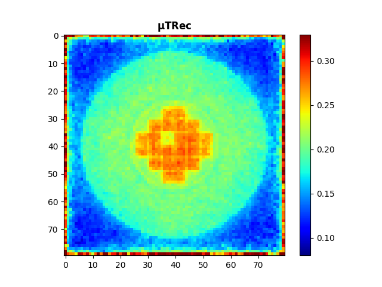
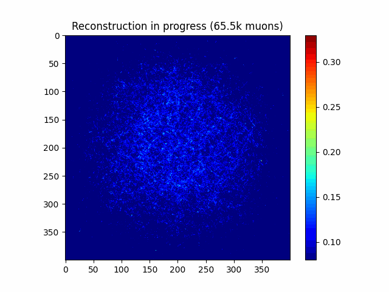

# μTRec: Muon Trajectory Reconstruction

A high-performance muon trajectory reconstruction library using JAX for hardware-accelerated calculations.

## Overview

μTRec processes muon hit data to reconstruct 3D density maps of scanned objects. It implements the Generalized Muon Trajectory Estimation (GMTE) algorithm for accurate muon path estimation and efficiently processes large datasets using JAX's JIT
compilation and GPU/TPU acceleration.

## Features

- **Fast reconstruction**: Optimized with JAX for GPU/TPU acceleration
- **Memory-efficient**: Processes large datasets in configurable chunks
- **Physics-accurate**: Implements GMTE for precise muon path estimation
- **Visualization**: Tools for viewing reconstruction results

## Installation

```bash
# Clone the repository
git clone https://github.com/jeappen/muTRec-algorithm.git
cd muTRec-algorithm

# Install dependencies
pip install jax jaxlib numpy matplotlib
```

## Usage

The full pipeline will be provided as a script in future releases. Meanwhile, you can use the provided functions in `Python/mutrec.py` to perform reconstruction.

## Sample Visualization

With a single rod missing and voxel size 50mm:



Animation of reconstruction process with voxel size 10mm. Done in seconds with a GPU (such as an NVIDIA T4 on Google Colab):



## Technical Details

The reconstruction pipeline:

1. Loads muon hit data from CSV files
2. Estimates muon paths using GMTE
3. Calculates scattering angles
4. Voxelizes paths and accumulates angular data
5. Produces 3D density maps of the scanned volume

The implementation uses JAX for automatic differentiation, vectorization, and hardware acceleration.

## Testing

Unit tests are provided to ensure correctness of the core functionalities. A full README.md is provided in the `tests` folder.
To run the tests, use:

```bash
pytest
```

## License

MIT License

## Citation

If you use this code in your research, please cite the original paper:
```
@article{10.1063/5.0278370,
    author = {Ughade, Reshma and Chatzidakis, Stylianos},
    title = {μTRec: A muon trajectory reconstruction algorithm for enhanced scattering tomography},
    journal = {Journal of Applied Physics},
    volume = {138},
    number = {6},
    pages = {064909},
    year = {2025},
    month = {08},
    issn = {0021-8979},
    doi = {10.1063/5.0278370},
    url = {https://doi.org/10.1063/5.0278370},
    eprint = {https://pubs.aip.org/aip/jap/article-pdf/doi/10.1063/5.0278370/20646234/064909_1_5.0278370.pdf},
}
```

Based on the work of [Chatzidakis et al. (2018)](https://arxiv.org/abs/1801.07795)
```
@article{Chatzidakis_2018,
   title={A generalized muon trajectory estimation algorithm with energy loss for application to muon tomography},
   volume={123},
   ISSN={1089-7550},
   url={http://dx.doi.org/10.1063/1.5024671},
   DOI={10.1063/1.5024671},
   number={12},
   journal={Journal of Applied Physics},
   publisher={AIP Publishing},
   author={Chatzidakis, Stylianos and Liu, Zhengzhi and Hayward, Jason P. and Scaglione, John M.},
   year={2018},
   month=mar }

```